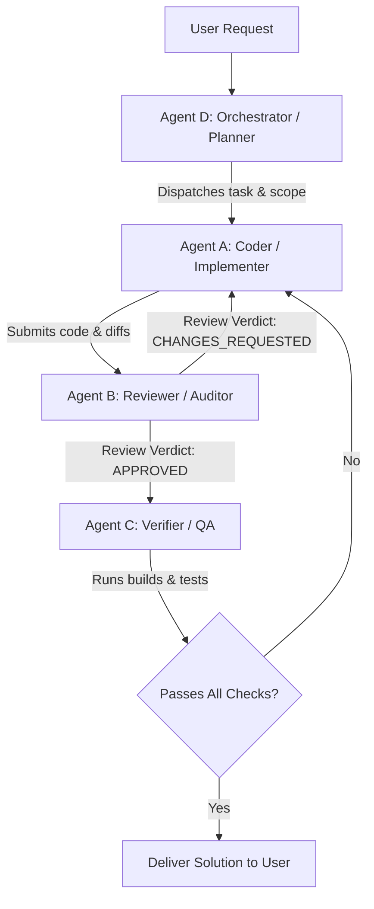

# Nicle AI Harness: Multi-Agent Orchestration Protocol

The **Nicle AI Harness** is a standardized protocol and operational framework that enables any AI model—including **Google Antigravity (Gemini)**, **Anthropic Claude Code**, and **OpenAI Codex**—to harness specialized subagents for distinct software engineering tasks within the Nicle IDE ecosystem.

---

## 1. Why Multi-Agent Harnessing?

When a single AI tries to plan, write code, audit security, and review diffs simultaneously, cognitive drift and confirmation bias occur:
- An authoring agent tends to overlook its own subtle edge-case omissions or safety violations.
- A dedicated **Reviewer Agent (Agent B)** operating with an adversarial, quality-focused posture catches panics, unbounded memory allocations, reactive state leaks, and architectural violations that the **Coder Agent (Agent A)** introduced.
- Strict separation of concerns guarantees that changes comply with Nicle's high-performance, zero-bloat architecture.



---

## 2. Specialized Agent Roles & Contracts

### Agent A: The Coder / Implementer
- **Primary Objective**: Implement the requested feature, bug fix, or refactor with minimal, idiomatic, high-performance code.
- **Scope & Constraints**:
  - **Rust (Backend)**:
    - Follow `PRD.md` and rules in `.agents/skills/rust-skills/SKILL.md`.
    - **Zero tolerance for panics**: Clippy strictly denies `clippy::unwrap_used` and `clippy::expect_used`. All fallible operations must return a `Result<T, AppError>` or handle errors gracefully.
    - Keep blocking I/O off the UI thread; use Tokio tasks or dedicated threads where appropriate.
    - Bound all reads and collections (e.g. max file preview size, max 1 MiB plugin log buffer).
    - Ensure all child processes, PTY sessions, and loopback servers clean up completely on exit.
  - **Svelte 5 / TypeScript (Frontend)**:
    - Use modern Svelte 5 runes (`$state`, `$derived`, `$effect`, `$props`).
    - **Never** put editor document contents or large search indices into global reactive state.
    - Adhere strictly to the graphite/dark theme token system in `design.md` (no purple accents, clean borders, cyan highlights).
  - **Scope Boundary**: Do not add unauthorized dependencies, LSP, Git engines, or in-editor AI completions unless explicitly directed.

#### Agent A Dispatch Prompt Template
```markdown
You are Agent A (Coder / Implementer) for Nicle IDE.
TASK: [Insert specific task description]
FILES TO MODIFY: [List target files]
INVARIANTS:
1. Rust: No .unwrap() or .expect(); follow rust-skills; keep memory bounded.
2. Svelte 5: Use runes ($state, $props); keep editor contents out of global reactive state.
3. Clean process lifecycle: Always ensure child processes and handles terminate cleanly.
OUTPUT: Deliver the modified code and explain key architectural decisions.
```

---

### Agent B: The Reviewer / Auditor
- **Primary Objective**: Perform rigorous, impartial code review of git diffs and new implementations before anything is accepted or merged.
- **Review Checklist**:
  1. **PRD & Architectural Alignment**: Does this change expand scope unexpectedly? Does it violate process isolation?
  2. **Rust Safety & Performance**:
     - Are there any `.unwrap()` or `.expect()` calls? (Must fail review if present).
     - Are allocations bounded? Are strings/vectors pre-allocated when capacity is known?
     - Are locks held across await points? (Must never happen).
     - Is error handling using `AppError` / `thiserror` properly?
  3. **UI & Svelte 5 Compliance**:
     - Are Svelte 5 runes used correctly?
     - Is reactivity bounded so that typing in the editor does not trigger re-renders across unaffected components?
     - Does the visual design conform to `design.md`?
  4. **Process & Resource Lifecycle**:
     - Are spawned child processes tracked and terminated when the window closes or the plugin stops?
     - Are network ports loopback-only (`127.0.0.1`)?
  5. **Regression & Test Coverage**:
     - Does the change break existing runners, PTY terminal, or plugin workflows?

#### Review Severity Levels
- **P0 - Blocker**: Panic risk, compile error, unhandled security/loopback leak, process leak, unwrap used.
- **P1 - Critical**: Functional bug, reactive loop, unbounded buffer, UI thread freeze.
- **P2 - Moderate**: Non-idiomatic pattern, missing documentation for subtle logic, sub-optimal allocation.
- **P3 - Minor**: Cosmetic code style, minor naming suggestion.

#### Agent B Output Format
```markdown
## Code Review Report
**Status**: [APPROVED | CHANGES_REQUESTED]

### Findings Summary
- P0 / P1 Findings: [Count]
- P2 / P3 Findings: [Count]

### Detailed Review
- [File:Line]: [Issue description and concrete fix proposal]

### Next Step
[Proceed to verification / Return to Agent A for fixes]
```

---

### Agent C: The Verifier / QA Agent
- **Primary Objective**: Execute automated builds, type checks, linting, and regression tests to verify that the project is 100% healthy.
- **Execution Pipeline**:
  1. Frontend Typecheck: `npm run check` (`svelte-check --tsconfig ./tsconfig.json`)
  2. Frontend Build: `npm run build`
  3. Backend Check: `cargo check --manifest-path src-tauri/Cargo.toml`
  4. Backend Clippy: `cargo clippy --manifest-path src-tauri/Cargo.toml -- -D warnings`
  5. Backend Tests: `cargo test --manifest-path src-tauri/Cargo.toml`
  6. Plugin & Harness Checks: `npm run validate-plugin` and `npm run harness:review`

---

### Agent D: The Orchestrator / Coordinator
- **Primary Objective**: Break down complex user prompts into actionable tasks, dispatch work to Agent A, hand off results to Agent B, coordinate fixes, and verify with Agent C before presenting the final result to the user.

---

## 3. How Different LLM Models Harness This System

### A. In Google Gemini / Antigravity
Antigravity agents possess native tools for subagent management:
1. **Define Subagents** (if specialized subagent definitions are needed):
   ```json
   {
     "name": "coder-agent",
     "description": "Agent A: Specialized Coder for Nicle IDE Rust & Svelte code",
     "system_prompt": "You are Agent A (Coder) for Nicle IDE. Adhere strictly to PRD.md and rust-skills...",
     "enable_write_tools": true
   }
   ```
2. **Invoke Subagents**:
   Use `invoke_subagent` to spawn Agent A or Agent B in parallel or sequentially:
   ```json
   {
     "Subagents": [
       {
         "Role": "Coder Agent (Agent A)",
         "TypeName": "self",
         "Prompt": "Implement [Feature X] in src/lib/plugins.svelte.ts following Nicle's reactive architecture."
       }
     ]
   }
   ```
3. **Dispatch Review**:
   Once Agent A delivers the code, call `invoke_subagent`:
   ```json
   {
     "Subagents": [
       {
         "Role": "Reviewer Agent (Agent B)",
         "TypeName": "self",
         "Prompt": "Review the git diff for [Feature X] against rust-skills and Nicle PRD rules. Output status and findings."
       }
     ]
   }
   ```

---

### B. In Anthropic Claude Code
Claude Code interacts with Nicle via `CLAUDE.md`, `.claude/skills/ai-harness`, and the terminal:
1. **Interactive Review**:
   Claude Code runs `npm run harness:review` or uses subagent task prompts.
2. **Command Palette Integration**:
   Inside Nicle IDE, Claude Code can be launched directly via the Command Palette (`Ctrl+Shift+P` -> `Claude Code: Open in Terminal`).
3. **Task Chaining**:
   Claude Code splits prompts into two phases:
   - Phase 1 (Agent A Persona): Write code according to `PRD.md`.
   - Phase 2 (Agent B Persona): Review git diff with `git diff` and verify with `npm run check && cargo check`.

---

### C. In OpenAI Codex / Cursor / Devin
Models operating via `AGENTS.md`:
1. The model automatically loads `AGENTS.md` at the repository root.
2. When assigned a task, the model uses the harness prompt envelope:
   - Sets context: `Role: Agent A (Coder)`
   - Performs code modification
   - Switches persona to: `Role: Agent B (Reviewer)` to evaluate diffs
   - Runs verification: `npm run harness:verify`

---

## 4. Built-in Harness Automation Commands

Nicle includes automated harness scripts in `scripts/ai-harness.js`:

| Command | Purpose |
|---|---|
| `npm run harness -- help` | Display AI Harness commands and status |
| `npm run harness:review` | Run automated Reviewer Agent (Agent B) audit on workspace git diff |
| `npm run harness:verify` | Run complete QA verification pipeline (Svelte check + Cargo check) |
| `npm run harness:dispatch` | Generate standardized task envelopes for Agent A or Agent B |

---

## 5. Summary of Operating Rules for All AI Models

1. **Always use Agent A for coding and Agent B for reviewing** on non-trivial features or refactors.
2. **Never skip Agent B review** before claiming a task is done.
3. **Never allow `.unwrap()` or `.expect()`** in Rust code.
4. **Never put editor document contents in global reactive state** in Svelte.
5. **Always ensure child processes and preview servers terminate** on exit.
