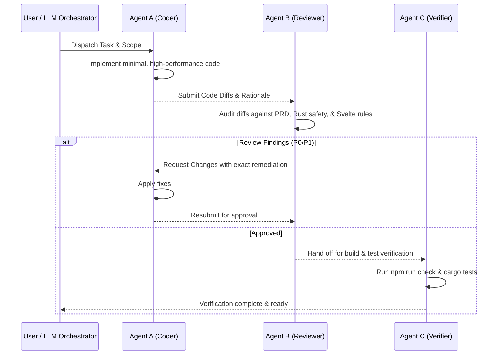

# Universal AI Agent Guide for Nicle IDE

Welcome to **Nicle IDE**. This repository is configured with a **Multi-Agent AI Harness** that enables any Large Language Model—including **OpenAI Codex / GPT**, **Google Antigravity / Gemini**, and **Anthropic Claude**—to coordinate specialized task subagents (such as **Agent A for coding** and **Agent B for reviewing**).

---

## 1. Multi-Agent AI Harness Framework

When handling non-trivial tasks (features, bug fixes, refactoring, API changes), **never use a monolithic single-pass generation**. Instead, split work across specialized agent roles:

### The Subagent Roles

| Agent Role | Title | Primary Responsibility | Key Focus |
|---|---|---|---|
| **Agent A** | **Coder / Implementer** | Write minimal, robust code | Follows `PRD.md`, `design.md`, and `rust-skills`. No unneeded deps. |
| **Agent B** | **Reviewer / Auditor** | Rigorous adversarial review | Audits diffs for `.unwrap()`, memory bounds, reactive leaks, security. |
| **Agent C** | **Verifier / QA** | Automated verification | Runs `npm run check`, `npm run build`, `npm run test:plugins`. |
| **Agent D** | **Orchestrator / Coordinator** | Deconstruct user goals | Plans execution, dispatches subagents, aggregates final report. |

For complete guidelines, prompt templates, and protocol details, refer to:
- [`.agents/skills/ai-harness/SKILL.md`](.agents/skills/ai-harness/SKILL.md)
- [`.agents/skills/rust-skills/SKILL.md`](.agents/skills/rust-skills/SKILL.md)

---

## 2. Core Repository Architecture & Rules

1. **Tech Stack**:
   - **Backend**: Rust (Tauri 2), Tokio async runtime, `portable-pty`, `tiny_http`.
   - **Frontend**: Svelte 5 (using modern runes: `$state`, `$derived`, `$props`), TypeScript, CodeMirror 6, xterm.js.
   - **Build System**: Vite 7, `tauri-build`, `svelte-check`.
2. **Strict Invariants**:
   - **Rust Safety**: `#![deny(clippy::unwrap_used)]` and `#![deny(clippy::expect_used)]` are enforced in `Cargo.toml`. Never call `.unwrap()` or `.expect()` in Rust. Always return a `Result<T, AppError>`.
   - **Reactivity & Memory**: Keep editor document contents out of Svelte's global reactive state. Bounded buffers: retain at most 1 MiB in-memory log buffer per plugin; lazy-load directory trees.
   - **Process Isolation**: All child processes, PTY shells, and preview servers must terminate cleanly when the window closes or the plugin stops.
   - **Security**: Preview servers and companion apps must bind **only** to loopback (`127.0.0.1`).
   - **Design**: Strictly follow graphite surfaces, cyan interactive accents, and dark/light tokens in `design.md` (no purple accents).

---

## 3. How Specific Models Harness This System

### If you are Google Antigravity / Gemini
- Antigravity supports native subagents:
  - Call `invoke_subagent` specifying:
    - `Role: "Coder Agent (Agent A)"`
    - `Prompt: "<task instructions, files to modify, constraints>"`
  - Once Agent A completes, invoke another subagent:
    - `Role: "Reviewer Agent (Agent B)"`
    - `Prompt: "<review diff against rust-skills and PRD.md>"`
  - Use `define_subagent` if defining persistent subagent personalities for the session.

### If you are Anthropic Claude Code
- Claude Code reads `CLAUDE.md` and `.claude/skills/ai-harness`.
- In your reasoning, explicitly adopt the **Agent A (Coder)** persona to implement code, then switch to the **Agent B (Reviewer)** persona to inspect `git diff`.
- Run `npm run harness:review` in the terminal to execute automated checks.

### If you are OpenAI Codex / Cursor / Devin
- Adopt the Agent A -> Agent B pipeline:
  1. Produce the change as Agent A.
  2. Perform self-audit as Agent B against the Review Checklist in `.agents/skills/ai-harness/SKILL.md`.
  3. Execute `npm run harness:verify` to ensure zero compilation or lint errors.

---

## 4. Common Developer & Agent Commands

| Task | Command |
|---|---|
| Run AI Harness Review | `npm run harness:review` |
| Run Full Verification | `npm run harness:verify` |
| Generate Agent Task Envelope | `npm run harness -- dispatch --role coder --task "<description>"` |
| Svelte / TypeScript Check | `npm run check` |
| Frontend Production Build | `npm run build` |
| Validate Plugin Manifests | `npm run validate-plugin` |
| Test Plugin Integration | `npm run test:plugins` |
| Rust Check | `cargo check --manifest-path src-tauri/Cargo.toml` |
| Rust Clippy | `cargo clippy --manifest-path src-tauri/Cargo.toml` |
